  

  
  &nbsp;·&nbsp;
  
  &nbsp;·&nbsp;
  
  &nbsp;·&nbsp;
  

---

<h2 id="sobre" align="center">
  
</h2>

**Oi, sou o Marcos Gabriel 👋**

Sou desenvolvedor full stack focado em construir produtos que realmente rodam no dia a dia da operação seja uma aplicação web responsiva ou uma ferramenta desktop.

No meu ecossistema principal, trabalho com **Python (Django, Flask, PyQt5)** no backend e desktop, além de **React, Vue.js, HTML5** e modelagem avançada em **SQL**. Hoje, venho expandindo e praticando ativamente meu repertório com **C#** e **TypeScript**.

Já desenvolvi e coloquei em produção sistemas corporativos de ponta a ponta (de Helpdesk e gestão a integrações operacionais). Boa parte desses projetos não está visível aqui no perfil por conta de acordos de confidencialidade (NDA) e termos contratuais, mas trazem a bagagem prática de quem resolve problema real em ambiente de produção.

💬 Aberto a freelas, colaborações e troca de ideias sobre engenharia de software e arquitetura. Fique à vontade para me chamar!

---

<h2 id="stack" align="center">🛠 Stack</h2>

---

<h2 id="projetos" align="center">
  
</h2>

| Projeto | O que faz | Stack |
| :-- | :-- | :-- |
| [**Sol-Mode**](https://github.com/HyperTechDevelopment/Sol-Mode) | Método de trabalho para agentes de IA, do pedido ao resultado verificado |    |
| [**MakeYourPoster**](https://github.com/HyperTechDevelopment/MakeYourPoster) | Editor de pôster com exportação em JPG, PNG e PDF |   |
| [**Dashboard-CLP**](https://github.com/HyperTechDevelopment/Dashboard-CLP) | Dashboard complementar ao sistema CLP |  |
| [**CLP-Controle-de-Lavagem-de-Placas**](https://github.com/HyperTechDevelopment/CLP-Controle-de-Lavagem-de-Placas) | Controle de lavagem de placas no setor industrial |  |

---

<h2 id="contato" align="center">
  
</h2>

  

  
  
  

---

  

  
  
  

  
  
  
  
  

  
  
  

  © 2026 Marcos Gabriel

